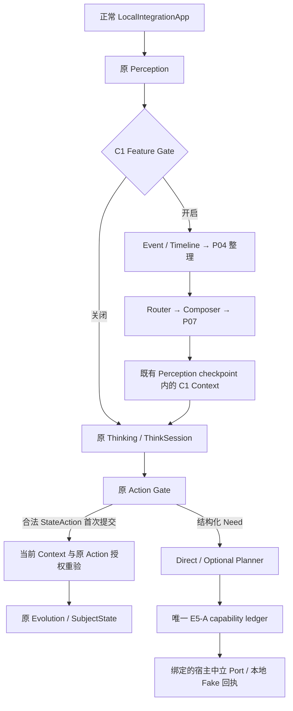

# P09 C1 正常运行链与架构边界

> P10 现行门：P00—P10 = ACCEPTED；P10 / P10 Engine side / P10-01—P10-12 = ACCEPTED；P10 Vio dependency = NONE；P11—P23 = NOT_STARTED；PLANNING_CONFLICT = NONE；EVIDENCE_CONFLICT = NONE（仅表示现行 P10 验收阻断已闭合）。 D-056 与最终依据见 [最终复核及验收记录](p10_evidence/launcher-repair-20260905/REVIEW_REPORT.md#p10-accepted)。Engine checkpoint `0115733d75f854e0d7c39062d8cb328a97995354`；Assistant 最终代码提交 `90f112b8be4617feb2d6387ceb2f77603302cee6`；[CI run 33896418682](https://github.com/yuan69082-code/continuity-assistant/actions/runs/33896418682) 为 794/794 PASS、0 SKIP、0 FAIL。历史 FAIL、SKIP、旧 CI failure、辅助错误及 P09 segment 10 stderr 缺失/根因 UNKNOWN 原样保留。

以下为 P09 验收时的档案快照；后续用户提交与 P10 开工事实见页首。

D-053 保留开工和返修历史；D-054 记录用户正式验收，P09/Engine/十二项当前 ACCEPTED。独立复核通过不等于用户验收，用户验收也不等于已提交。原状态、失败与 UNKNOWN 历史保留；[验收依据和档案后检查](50_P09_测试索引与C1运行入口.md#p09-accepted)单列。

## 开工 Stage Brief（历史，D-053）

| 项目 | 本轮范围 |
|---|---|
| STAGE | P09 C1 Continuity Core，IN_PROGRESS；独立复核与用户验收尚未完成 |
| SOURCE OF TRUTH | 三份 2026-08-26 同步版：全周期 v1.1、长期能力 v6.7、Assistant v0.1；D-052 与用户本次 P09 授权/D-053 |
| ORIGINAL REQUIREMENTS | P03—P08 接入正常运行链；连续性、迟到、撤销、矛盾、预算、权限、重启组合；独立长期运行、Snapshot/Branch、宿主中立契约 |
| V6.7 DETAILS | 两类 Need；简单 Direct；Feature Gate、Genesis、State Fixture、Context Trace；只读 elapsed-time 情绪衰减，保存仍须合法 Evolution |
| AMENDMENT OVERRIDES | 独立于 Vio；保留唯一 E5-A；P08 Planner 可选；P10 后置实际建仓；P17/P20/P21 恢复边界不提前 |
| KEEP RULES | SubjectState 唯一当前状态；Event 历史；Memory/Summary/Context/矛盾分层；Trace 不含秘密或隐藏思维链；TEST 不晋升 |
| DEPENDENCIES | P00—P08 已 ACCEPTED；main/P08 来源 fb8713ccb049ca082079cf820d06956be0954af9；本轮基线 700/700、139.559 秒 |
| NOT READY | C1 尚未稳定验收；P10—P23 未开始；生产 Adapter、Dynamic Mind、Scheduler、生产恢复不在本轮 |
| FILES ALLOWED | 既有正常交互/Thinking/Action 协调、必要内部领域/持久化兼容扩展、CLI 可运行入口、现有 P01 设施、P09 Fixture/组合测试和工程档案 |
| FILES FORBIDDEN | 六份冻结外部 Schema、外部机器契约、pyproject/0.1.0、正式数据、三份源 DOCX、Vio、Git 元数据写操作 |
| TESTS REQUIRED | 新阶段专项/组合；原 E5-A/P02 与 P03—P08；三轮全量；有界长期场景；档案后专项/全量；静态/隔离/hash/链接/diff |
| PLANNING CONFLICT | NONE；若实际需要突破授权，停止对应项并报告，不静默缩减要求 |

v1.1 SHA-256 `9cbc30b5beb7f12c046556bd9461b59d5d4e45c2315dc2da4f07c8bd132ae1a1`；v6.7 `a47bfb5e19092ee11963c0554897fbb29cbbba775183bddecb284c24f3788027`；Assistant `5513e8241a96f4d661d9520cbcb3c2ea9914ca8d430b2db4dacc13ba3dd744a1`。P09 最终 C1 来源 SHA 尚不存在，须待用户正式验收并提交后确定。

本简报记录用户本次已明确授权的施工范围，不能解释为 P09 已实现或已验收。实际接线、矩阵与结果随施工追加；旧阶段历史状态保持原样。

## 已完成的接线与所有权

| 位置 | 接线与责任 | 持久化所有者 |
|---|---|---|
| `interfaces/local_integration_app.py` | 在原组装函数增加可选 clock、Thinking Provider、C1 factory、validator/result factory 和权限注入；缺省旧路径不变，非新 HTTP 契约 | 原有各仓储 |
| `services/continuity_interaction_service.py` | 在原 Perception checkpoint 前 prepare、首次 Thinking/Action 及首次 Evolution 前重验当前授权、原 Action Gate 后调用 P08；完成结果重放复核回执与原 Evolution 绑定 | 原 operation journal、ThinkSession、result ledger |
| `services/continuity_core_runtime.py` | 组装已有 Timeline、P04、Router、Composer、P07 与 P08 Port；只允许本阶段 TEST/RESEARCH | 原 SubjectState、Memory、非权威 P07 审计 |
| `services/continuity_core_service.py` | 有界整理、精确来源/权限复核、只读情绪、结构化 Need 到 Direct/Planner；恢复优先核实原事实 | 原 E5-A capability ledger；无 C1 Store |
| `domain/continuity_core.py` | 可消费 Context 及 Perception 绑定，保存原来源版本/hash/provenance；完整输入（含动作开关）关联既有 progress/Thinking/Action；规范化且有界模型输入 | 嵌入已有 checkpoint，无第二 Context Store |
| `services/context_composer_service.py` | 可选完整材料成本回调；C1 成本计入序列化元数据，旧 P06 默认估算与裁剪/去重/缺失机制保留 | 无写入 |
| `testing/c1_snapshot.py` | 显式版本化 P01 C1 profile，完整映射新增物理文件；缺失/未知拒绝 | 既有 P01 Snapshot/Branch，仅 TEST |

图示表示依赖和选择，不要求每条请求执行全部能力；例如关闭 memory/contradiction/actions/emotion 子开关时不读取或写入对应组件。C1 的新输入、请求与动作需要当前来源/授权；原已执行事实恢复不借过期 Context 取得新执行权限。外部 Observation/模型文本不自动转成权威 Event。图中的当前授权门只用于首次状态提交；已存在原 Evolution 先按稳定事件身份查证绑定，再恢复既有事实，不重复推进 revision。

P07 核实与来源 proof 仍是独立 Port；Snapshot 中的自洽审计不产生可信证据权，恢复时仍需原可信 verifier。Direct 不创建 Goal/Plan；复杂行动保留原 Planner 与每个 step 的稳定身份。P09 不承担生产传输、Provider/凭据、Scheduler、Dynamic Mind、Execution Engine 或正式主体灾难恢复。

实际状态及复核入口见 [48 矩阵](48_P09_规划施工测试验收矩阵.md)、[49 恢复与真实失败](49_P09_恢复组合语义与施工证据.md)、[50 测试及 C1 命令](50_P09_测试索引与C1运行入口.md)。

第二轮返修仅收紧既有完成/恢复校验，并修复 TEST long harness 的证据生命周期。是否有完成状态事实由原 Action/ThinkSession/projection 交叉决定，不能由 nullable evolution checkpoint 决定；核实来源、mutation、revision、event/update 与授权绑定后才可只读重放。测试失败输出在临时根清理前独立保存，不形成 Engine 第二账本或生产日志系统，见 [第二轮索引](50_P09_测试索引与C1运行入口.md#p09-repair-02)。

## P10 正式验收收尾（2026-09-05，D-056）

P00—P10 = ACCEPTED；P10 / P10 Engine side / P10-01—P10-12 = ACCEPTED；P10 Vio dependency = NONE；P11—P23 = NOT_STARTED；PLANNING_CONFLICT = NONE；EVIDENCE_CONFLICT = NONE（仅表示现行 P10 验收阻断已闭合）。

规划监工最终独立核对确认 Engine checkpoint `0115733d75f854e0d7c39062d8cb328a97995354`、Assistant 最终代码提交 `90f112b8be4617feb2d6387ceb2f77603302cee6`、P10 工程检查 14/14 PASS、原 770 项与新增 24 项身份完整，以及 [CI run 33896418682](https://github.com/yuan69082-code/continuity-assistant/actions/runs/33896418682) 794/794 PASS、0 SKIP、0 FAIL。Temp 内远程干净克隆的构建、安装、Golden、来源和两个 Fixture 入口的路径隔离验证通过；冻结边界、正式 7 文件及版本 0.1.0 未变。

D-056 登记的是用户此前给出的条件式验收在独立核对通过后生效。当前冲突归零不改写历史：首次 Temp 失败、Windows 大小写漏项、旧 CI failure、统计入口导入失败、辅助工具错误、各次 SKIP，以及 P09 segment 10 stderr 缺失且根因 UNKNOWN 均保留。P11—P23 未开始；不创建标签或发布。
